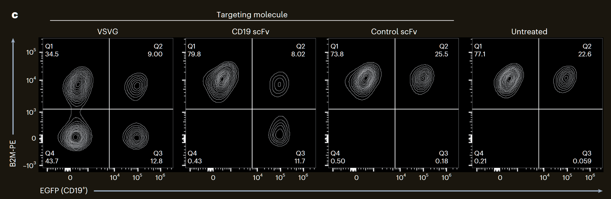
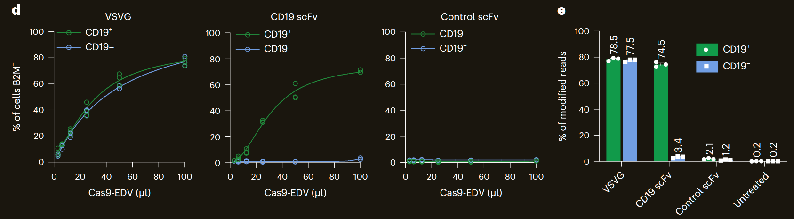
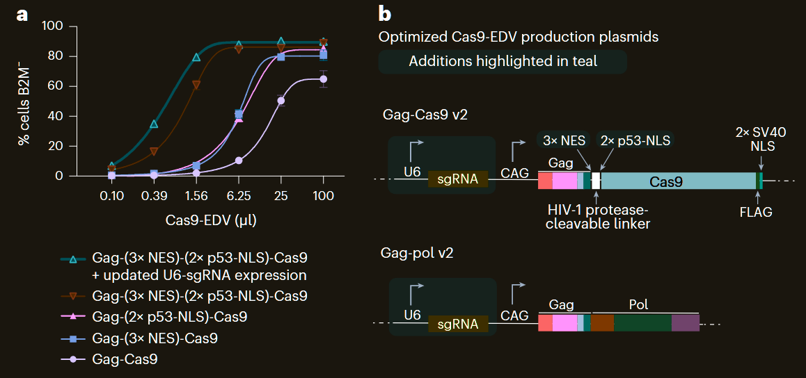
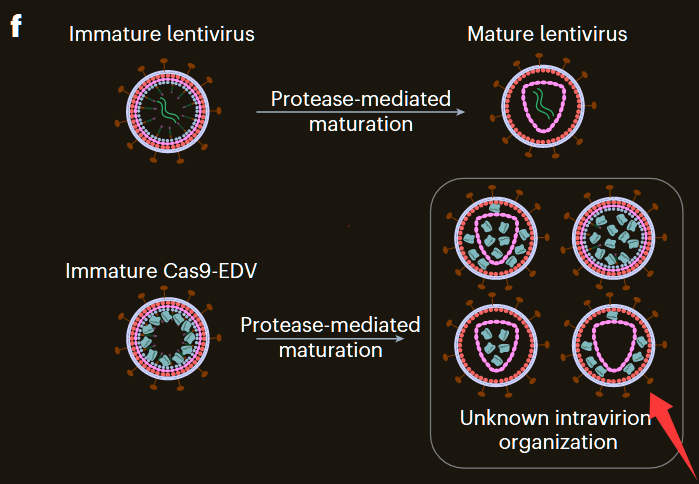
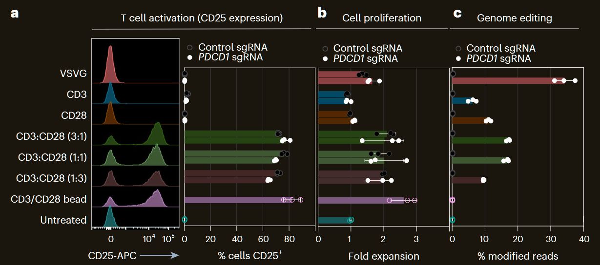
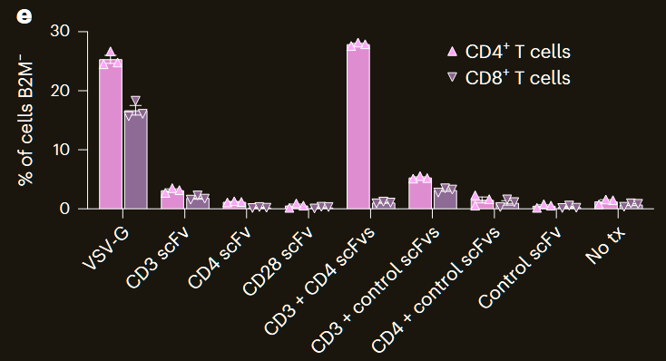
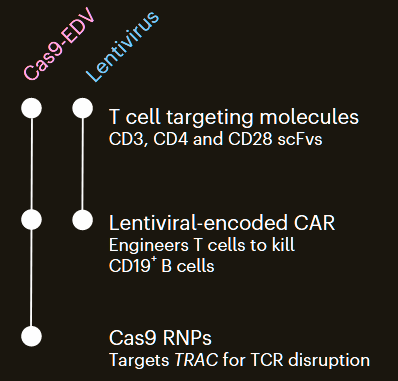
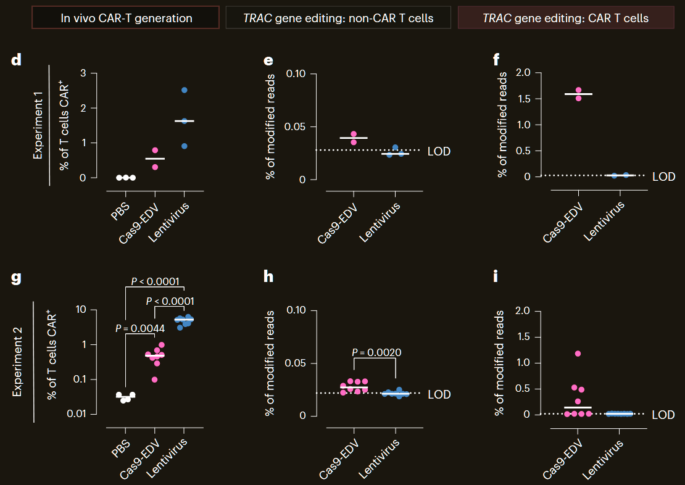
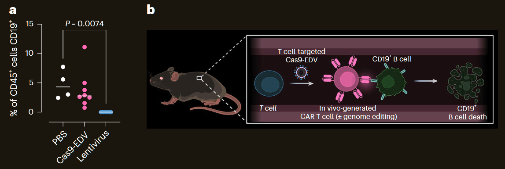

***

# (11/2024) In vivo human T cell engineering with enveloped delivery vehicles（）

| <!-- --> |
| ------------------------------------------------------------------------------------------------------------------------------------------------------------------------------------------------------------------------------------------------------------------------------------------------------------------------------------------------------------------------------------------------ |
| **期刊: Nature Biotechnology**（发表日期: **11/2024**） **作者:** Jennifer R. Hamilton; Evelyn Chen; Barbara S. Perez; Cindy R. Sandoval Espinoza; Min Hyung Kang; Marena Trinidad; Wayne Ngo; Jennifer A. Doudna                                                                                                                                               |
| **DOI: **[10.1038/s41587-023-02085-z](https://doi.org/10.1038/s41587-023-02085-z)                                                                                                                                                                                                                                                                                                                |
| **笔记创建日期: **2025/7/13 14:55:50                                                                                                                                                                                                                                                                                                                                                                   |
| **期刊分区: **ㅤㅤ ㅤㅤIF 41.7 ㅤㅤ ㅤㅤ ㅤㅤ ㅤㅤ ㅤㅤ ㅤㅤSCI Q1 ㅤㅤ ㅤㅤ ㅤㅤ ㅤㅤ ㅤㅤ ㅤㅤ中科院 生物1区 ㅤㅤ ㅤㅤ |
| **Local Link: **[Hamilton 等 - 2024 - In vivo human T cell engineering with enveloped delivery vehicles.pdf](zotero://open-pdf/0_JHPN2JR3)                                                                                                                                                                                                                                                        |

## 💡创新点

## 📚前言及文献综述

### 摘要

以前：病毒与病毒衍生颗粒难以快捷改变细胞选择性，限制了它们delivery的用途；

发现：封装在膜衍生的颗粒上显示的抗体片段的细胞表面标记识别包含CRISPR – CAS9蛋白和引导RNA的粒子可以将基因组编辑工具传递给特定细胞。

优势：这些CAS9包装包裹的递送载体（CAS9-EDV）利用可预测的抗体 - 抗原相互作用，将基因组编辑机器瞬时递送至感兴趣的细胞

结果：体外/体内靶向性好；在人源化小鼠中诱导了CAR-T

## 🧩数据

## 🔬方法

## 📜结论

### 1. <a href="zotero://open/library/items/JHPN2JR3?page=2">“Receptor-mediated delivery and genome editing with Cas9-EDVs”</a>  使用Cas9-EDVS的受体介导的递送和基因组编辑

把Cas9融合到病毒Gag蛋白N端可以包装Cas9 RNP。

为了测试是否可以将VLP重塑为可编程EDV，首先将CD19靶向抗体作为SCFV，融合到CD8A的茎和跨膜域，这是一种在CAR架构中常用的策略。

为了分析CAS9-EDV的受体介导的功能，培养HEK293T细胞系，该细胞系共表达B细胞配体CD19和EGFP，从而评估在target EGFP+细胞和远距离EGFP-旁观者细胞中基因组编辑的效果（F1B）。基因编辑的靶向基因是B2M，做了四组VLP（VSVGmut、CD19scFv+VSVGmut、对照scFv+VSVGmut、无VLP处理），两组细胞（右侧为Target）结果如图F1CDE：

结果说明靶向性良好、效率良好。

### 2. <a href="zotero://open/library/items/JHPN2JR3?page=3">“Programmable cell-specific genome editing with Cas9-EDVs”</a> 使用CAS9-EDVS的可编程细胞特异性基因组编辑

把靶向的配体换成CD20、CD4、CD28重复以上实验，结果一致，证明这个系统具有优良的可编程性和靶向性。

### 3. <a href="zotero://open/library/items/JHPN2JR3?page=3">“Cas9-EDV optimization and study of nonessential components”</a>  CAS9-EDV优化和非必需组件的研究

发现在Cas9 N段加2×NLS、Gag蛋白C段加3×NES最能提高编辑效率。同时从Gag-NES-NLS-Cas9 and Gag-pol 质粒骨架里表达sgRNA也比单独设计一个质粒效率更高：

评估，在离体的人CD34+细胞和人T细胞（细胞因子激活）中，经改造的Cas9-EDV（VSVGmut）表现出了增强的基因编辑效率。且发现在静息T细胞中也表现了较高编辑效率。

为了搞清楚衣壳在过程中的作用，用了阻遏衣壳入核和脱衣壳的试剂GS-CA1，发现并没有降低编辑效率。表明，将CAS9 RNP复合物包装和输送到靶细胞核中并不需要衣壳。

### 4. <a href="zotero://open/library/items/JHPN2JR3?page=3">“Optimized Cas9-EDV characterization”</a>  优化的CAS9-EDV表型

1.  Cas9-EDV和LV的直径相同，Cas9-EDV上能检测到scFv
2.  相比于Cre-EDV，Cas9-EDV能包装远多的sgRNA，并且Cas9-EDV不会误包装生产细胞中的质粒
3.  发现用0.2μl的30倍浓缩Cas9-EDV处理导致基因组编辑的等效量为〜23 pmol的核成核RNP
4.  野生型VSVG和VSVGmut比较生物分辨率，发现VSVGmut不会阻碍体内颗粒运输

### 5. <a href="zotero://open/library/items/JHPN2JR3?page=5">“Multiplexed targeting molecules for human T cell engineering”</a>  人类T细胞工程的多路复用靶向分子

发现同时表达CD3+CD28 scFv的Cas9-EDV能像CD3/CD28磁珠一样激活T细胞，并能引起基因编辑：

测试了其他种类的scFv。同时发现CD4靶向的结果特异性地编辑了T细胞的CD4+subset，并且同时用CD3和CD4靶向的效率比它们单独靶向的效率高，其它靶向分子的联用无此协同作用：

### 6. <a href="zotero://open/library/items/JHPN2JR3?page=5">“T cell targeted Cas9-EDVs enable genome engineering in vivo”</a>  T细胞靶向CAS9-EDV在使体内基因组工程成为可能

使用Cas9-EDV和慢病毒载体处理两批免疫系统人源化的小鼠如图，其中Cas9-EDV载体额外添加针对TRAC的基因编辑：

day0接种，day10分析脾脏免疫细胞。

第一批实验各处理三只小鼠，第二次实验换PMBC，各处理八只小鼠，结果发现Cas9-EDV的组能在CAR+细胞中特异性地介导基因组编辑。但CAR+细胞的比例低于慢病毒组。

检测二次试验中的CD19+B细胞（CAR-T靶向的细胞），发现Cas9-EDV组清除不如慢病毒组彻底，提示需要进一步优化。

## 🤔思考

为什么Cas9-EDV组没能彻底消除CAR的靶细胞？

为什么Cas9-EDV组产生的CAR+细胞比例低于慢病毒组？

如何改进以提高改造效率？
