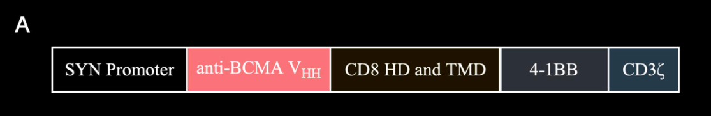

***

# (07/2025) In-vivo B-cell maturation antigen CAR T-cell therapy for relapsed or refractory multiple myeloma（）

| <!-- --> |
| ------------------------------------------------------------------------------------------------------------------------------------------------------------------------------------------------------------------------------------------------------------------------------------------------------------------------------------------------------------------------------------------------ |
| **期刊: The Lancet**（发表日期: **07/2025**） **作者:** Jia Xu; Lin Liu; Philippe Parone; Wei Xie; Chunyan Sun; Zhaozhao Chen; Jishuai Zhang; Chunrui Li; Yu Hu; Heng Mei                                                                                                                                                                                       |
| **DOI: **[10.1016/s0140-6736(25)01030-x](https://doi.org/10.1016/s0140-6736\(25\)01030-x)                                                                                                                                                                                                                                                                                                        |
| **笔记创建日期: **2025/7/18 17:16:51                                                                                                                                                                                                                                                                                                                                                                   |
| **期刊分区: **ㅤㅤ ㅤㅤIF 88.5 ㅤㅤ ㅤㅤ ㅤㅤ ㅤㅤ ㅤㅤ ㅤㅤSCI Q1 ㅤㅤ ㅤㅤ ㅤㅤ ㅤㅤ ㅤㅤ ㅤㅤ中科院 医学1区 ㅤㅤ ㅤㅤ |
| **Local Link: **[Xu 等 - 2025 - In-vivo B-cell maturation antigen CAR T-cell therapy for relapsed or refractory multiple myeloma.pdf](zotero://open-pdf/0_NQTLN55C)                                                                                                                                                                                                                               |
| **临床实验数据：**<https://clinicaltrials.gov/study/NCT06691685>                                                                                                                                                                                                                                                                                                                                        |

## 💡创新点

第一项针对多发性骨髓瘤的体内CAR T疗法

第二项报道的体内CAR T疗法

## ✍️生词

<a href="zotero://open/library/items/NQTLN55C?page=1">“relapsed”</a> (<a href="zotero://select/library/items/PW8IYKKX">Xu 等, 2025, p. 1</a>) v. 复发；故态复萌；退步；恶化； n. 【医】再发；故态复萌；退步；堕落； 网络释义： 复发的；疾病复发

<a href="zotero://open/library/items/NQTLN55C?page=1">“refractory”</a> (<a href="zotero://select/library/items/PW8IYKKX">Xu 等, 2025, p. 1</a>) adj. 难以驾驭的；行为乖戾的；难以诊治的；难以治愈的； n. 倔强的人；耐火矿石\[金属]；耐熔质； 网络释义： 耐火材料；耐火的；难治的

<a href="zotero://open/library/items/NQTLN55C?page=1">“in situ”</a> (<a href="zotero://select/library/items/PW8IYKKX">Xu 等, 2025, p. 1</a>) 原位

<a href="zotero://open/library/items/NQTLN55C?page=1">“scarce”</a> (<a href="zotero://select/library/items/PW8IYKKX">Xu 等, 2025, p. 1</a>) adv. 勉强；刚；几乎不；简直不； adj. 缺乏的；不足的；稀少的； 网络释义： 稀有的；罕见的

<a href="zotero://open/library/items/NQTLN55C?page=1">“obviate”</a> (<a href="zotero://select/library/items/PW8IYKKX">Xu 等, 2025, p. 1</a>) v. 排除；消除；打消； 网络释义： 避免；除去；预防

<a href="zotero://open/library/items/NQTLN55C?page=1">“apheresis”</a> (<a href="zotero://select/library/items/PW8IYKKX">Xu 等, 2025, p. 1</a>) n.  析离术；血液成分置换；分离

<a href="zotero://open/library/items/NQTLN55C?page=1">“circumvent”</a> (<a href="zotero://select/library/items/PW8IYKKX">Xu 等, 2025, p. 1</a>) v. 规避；设法回避；绕过；绕行； 网络释义： 包围；围绕；智取

<a href="zotero://open/library/items/NQTLN55C?page=1">“tropism”</a> (<a href="zotero://select/library/items/PW8IYKKX">Xu 等, 2025, p. 1</a>) n. （生物的）向性； 网络释义： 嗜性；趋性；趋向性

<a href="zotero://open/library/items/NQTLN55C?page=1">“mitigate”</a> (<a href="zotero://select/library/items/PW8IYKKX">Xu 等, 2025, p. 1</a>) v. 减轻；缓解；缓和；平息； 网络释义： 镇静；减缓；使缓和

<a href="zotero://open/library/items/NQTLN55C?page=1">“Cranial”</a> (<a href="zotero://select/library/items/PW8IYKKX">Xu 等, 2025, p. 1</a>) adj. 颅的；颅侧的； 网络释义： 头盖的；颅骨的；脑神经

## 📚前言及文献综述

介绍了CAR T疗法的优势和缺点，介绍了in vivo CAR T的优势，并指出其临床数据不足

## 🔬方法

### ESO-T01是什么？

ESO-T01是纳米抗体靶向、免疫屏蔽的慢病毒载体，用于具有人源化抗B细胞成熟抗原（BCMA）单位抗体CAR的体内T细胞工程。

1.  为避免慢病毒对哺乳动物细胞的广泛嗜性，ESO-T01的囊泡性口腔炎病毒糖蛋白G中的关键残基被突变；

2.  病毒膜改造：过表达CD47，从而抑制单核吞噬系统的吞噬作用；同时加入抗T细胞受体纳米抗体以实现T细胞靶向；

3.  敲除MHC-I以减少免疫原性。

CAR基因构成：T细胞特异的合成启动子、anti-BCMA重链可变区、人CD8铰链区和跨膜区、4–1BB共刺激区、CD3 zeta激活区

ESO-T01在临床前试验表现优秀。本次首次应用于四位临床患者。

### 临床试验如何进行的？

本研究是单臂、开放标签、剂量递增的 I 期临床研究，检验ESO-T01的安全性，耐受性和初步功效。

> 所有患者均接受单次静脉输注 ESO-T01，起始剂量为 2.0×10⁸ 转导单位，无需预先进行单采或淋巴细胞清除。输注前预防性给予盐酸异丙嗪。
>
> 临床医师酌情使用双氯芬酸钠栓剂，以防输注后体温骤升，尽管该措施并未写入研究方案。鉴于病例 1 的输注后反应，病例 2–4 在输注前额外加用 20 mg 地塞米松。
>
> 输注后，所有患者均接受 24 小时心电监护，并在前 48 小时内予以隔离，作为安全预防措施；该措施虽未被方案预设，但出于潜在交叉感染的考虑而执行。

## 📜结果/结论

### 不良反应

• 所有患者输注后 24 h 内出现急性炎症反应（寒战、高热、低血压、低氧血症），3 例出现 3 级 CRS；1 例发生 1 级 ICANS。\
• 3–4 级血液学毒性普遍但可逆；2 例并发肺部感染。\
• 病毒血症高峰在 12 h，48 h 后基本清除，未在尿液/唾液/CSF 中检出病毒。

详细不良反应结果见附录<a href="zotero://open/library/items/QT4L9R6Z?page=10">“Table S3”</a> (<a href="zotero://select/library/items/PW8IYKKX">Xu 等, 2025, p. 8</a>)

### 随访疗效

截至 2025 年 4 月 1 日，所有患者均已完成 2 个月随访，前 2 例患者已完成 3 个月随访。

*   病例 1 在第 2 个月达到严格完全缓解sCD，所有髓内及髓外病灶完全消失（附录第 4 页）。

*   病例 2 在第 28 天即达到严格完全缓解sCD，病灶全部消退（附录第 4 页）。

*   病例 3 和 4 获得部分缓解PR：第 28 天肿瘤病灶缩小，骨髓达到微小残留病MRD阴性（附录第 4、9 页）。\
    在第 2 个月随访时，病例 3 的血清蛋白电泳及游离轻链浓度恢复正常，病例 4 的上述指标进一步下降（附录第 9 页）。

### CAR T细胞动态

CAR-T 细胞在外周血第 4–8 天出现、10–17 天达峰，并广泛分布于骨髓、肿瘤、胸水及脑脊液。肿瘤活检证实病灶显著缩小且伴随 T 细胞浸润。不同患者 CAR-T 表型差异明显。

## 🤔思考

### 疗法优势

1.  无需预先进行单采或淋巴细胞清除
2.  剂量小（1/10小鼠计算的等效质量）且能获得的体内暴露水平与已上市的两款标准 BCMA体外CAR-T 产品处于同一数量级
3.  病毒颗粒小，更好地浸润肿瘤组织

### 展望

仍需扩大样本、延长随访，并开展随机对照试验以进一步验证其持久性和安全性
