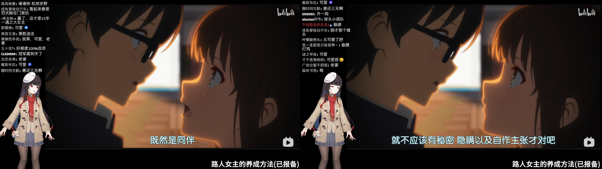

:::note
这篇文字是2月26日写的，现迁移到博客。
:::

> 动画名：[**冴えない彼女の育てかた**](https://bgm.tv/subject/100403)（路人女主的养成方法）
>
> 脚本: [丸戸史明](https://bgm.tv/person/6126)
>
> 动画制作: [A-1 Pictures](https://bgm.tv/person/3525)

这几天跟着泛式直播二刷了《路人女主的养成方法》，这次二刷get到了很多几年前初次观看时囫囵吞枣的、理解不了的细微情感波动，真是一部优秀的作品。

这次二刷最大的收获一个就是对男主的改观：以前以为男主是经典轻小说桃花运爆棚废柴男主人设，二刷完全被这个人强大的执行力和行动力折服了——经营推荐网站、捧火学姐的书，放到现在就是二次元领域的顶流UP主，只是两个超级天才的光芒让男主的才能显得比较暗淡<del>（当然，也和男主宅味太冲有点关系）</del>。感情线以外，事业线也很励志，讲的是对行业充满激情的普通人如何在一众天才中立足，并且成为带领天才前进的人的故事。

当年看第二季的时候我还是中学生，看到英梨梨的第二次背叛时给我看红温，直接弃番了，如今再刷一遍，还是没办法和她和解，依然是觉得英梨梨这个人很欠揍。英梨梨与伦也的关系性上，不管是第一次背叛的和解，还是那须高原别墅的一晚，放眼看去英梨梨都是赢面最大的一个女主，但她却在关键时刻从社团出走，第二次背叛了男主。——即使从社团出走是无可奈何的，也还完全有解决办法，英梨梨决定离开之后如果第一时间告诉男主，向他解释，一定还有下一次机会，但是就硬要拖到几周后，男主兴致勃勃地拿着新企划来问时，把他踢进众叛亲离的境地。

英梨梨作为跟男主最熟悉、初始牵绊值最高、跟男主情感纠葛最深的幼驯染，却最后落得最难堪的败犬下场，实在是咎由自取。

诗羽学姐性格很好，也很主动，但男主自始始终与她保持了读者与作者、粉丝与作家、同伴与同伴的距离感与界限，始终没有发展为进一步的关系，只能说命运不公了。

.webp)

加藤惠自不必说，时至今日，她现在仍然是几乎所有的二次元心中的白月光。毫无疑问地，她是最令人艳羡的“女主角”。

距离这部动画第一季开播已经整整十年了，在初次观看这部动画的时候，我还会有那种观赏青春恋爱作品时萌生的微妙“嫉妒”心情，如今我当然已经能抱有纯粹欣赏的心态观看这部作品。但是明知虚幻，却也忍不住在想，我人生中的“路人女主” 还会出现吗？

.png)

***

<iframe  width="100%" height="468" src="//player.bilibili.com/player.html?isOutside=true&aid=114026080112210&bvid=BV1rDAveiEGk&cid=28461762237&p=1" scrolling="no" border="0" frameborder="no" framespacing="0" allowfullscreen="true"></iframe>