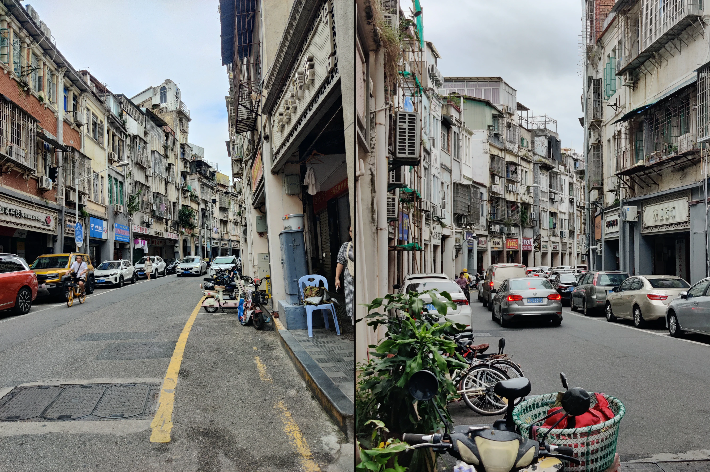
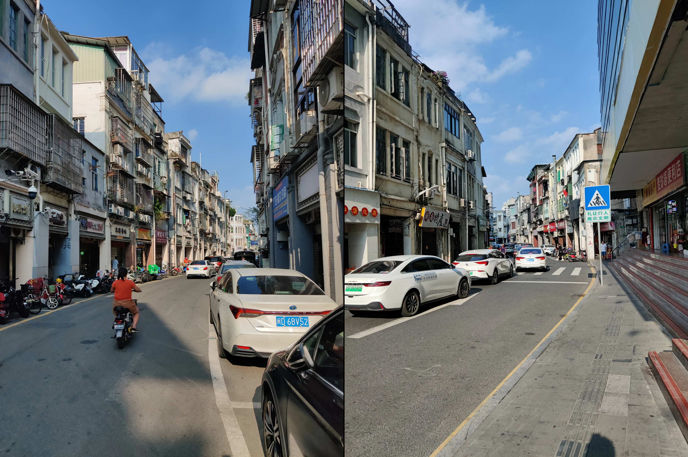
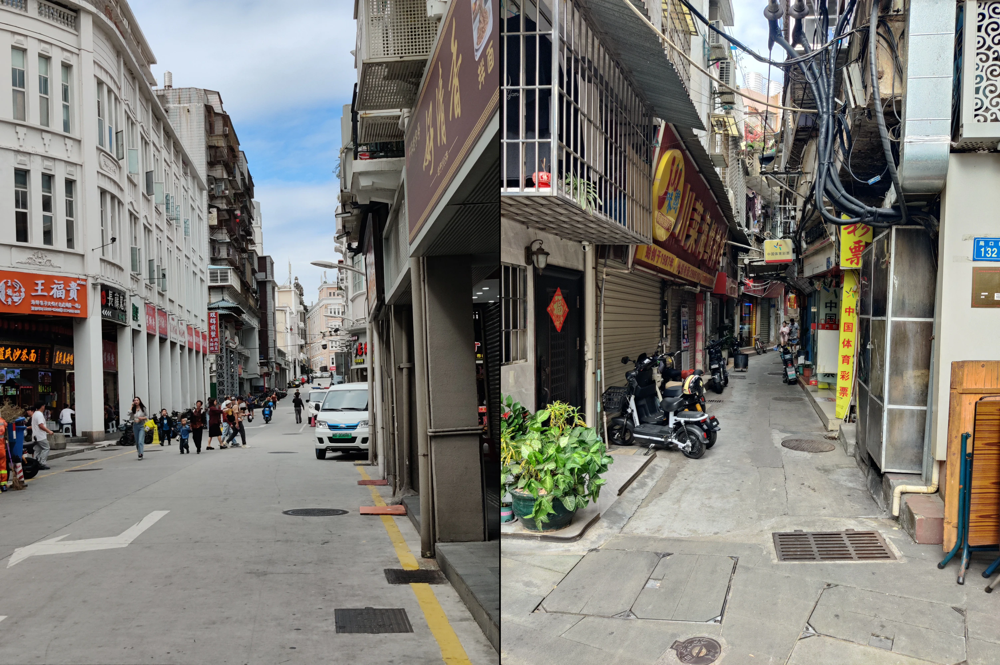

:::note
这篇文字是2024年10月3日写的，现迁移到博客。
:::

厦门的街景确实是与故乡大不相同的，规划局促，道路狭窄，一会上坡一会下坡，道路弯弯绕绕；而石家庄地处平原，道路四四方方，井然有序，街景却少了几分鲜活的生命力，多了几分呆板。

我家在镇里，还记得小时候总觉得回村里的爷爷奶奶家就已经是路途不短的旅行，石家庄市区更是感觉非常遥远，一个多小时的车程常常在睡梦中度过；如今远离家乡读书求学，每次放假时，刚下高铁，看到熟悉的平原，亲切感就扑面而来，仿佛已经回到了家中。

倘若有一天我去更遥远的地方求学或者工作，这份亲切感大概也会施加到厦门的一草一木上吧。

