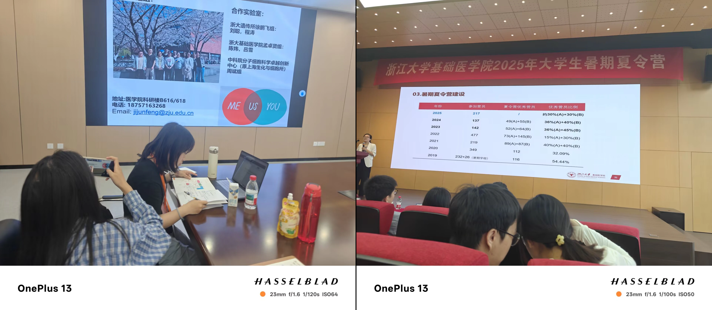
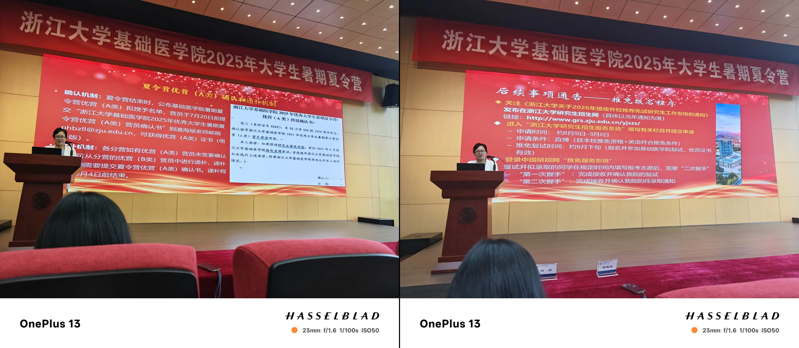
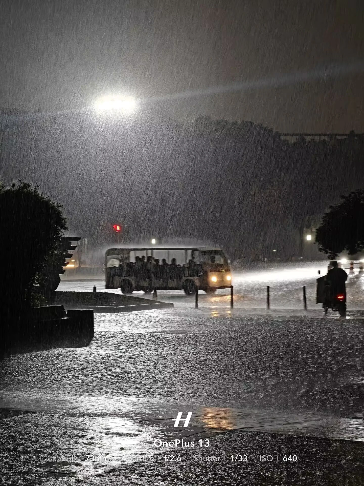
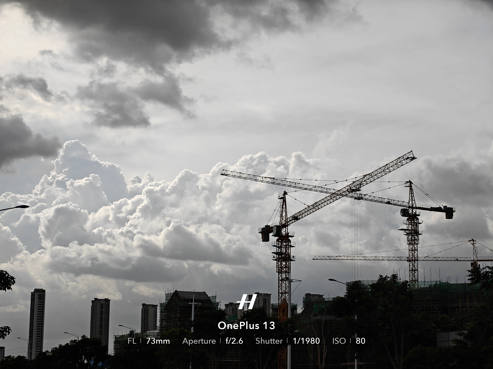

浙基础医招生规模小，各个学系差别大，面经珍贵，还请珍惜

# 0️⃣关于报名

联系导师极重要，入营不知道是不是弱com但是录取绝对是弱com，我报名时联系了导师被官回，后来举行夏令营期间联系了另外的导师，后来这个导师推荐的我优营。

# 1️⃣夏令营

## ①夏令营概览

7.4~7.6，4日下午报到，5日开营仪式+导师宣讲，6日面试+闭营仪式，闭营仪式上会宣布优营A和优营B的名单。

| 时间 | 活动                                      |
| ---- | ----------------------------------------- |
| 7.4  | 下午注册报到                              |
| 7.5  | 开营仪式+导师宣讲                         |
| 7.6  | 面试+闭营仪式 宣布优营A和优营B的名单 |

优营A是铁offer，需要签承诺书（给了考虑时间，不必当场签），优营B预推免优先考虑，并且前序的A放弃签承诺书后可以候补为A。

## ②夏令营面试

由各个学系分别进行，形式上各有不同。干细胞系的面试采用群面，也就是多对多的面试，因此无需准备PPT。每个老师的手里都有面试学生的详细信息（你在系统填报的）。

进门落座之后首先进行**英文自我介绍**（~~老师在群里通知准备自我介绍但是没说要英文，本人压根没准备，硬挤了一段后，自己的科研项目用中文讲的~~），随后开始提问，有抢答、轮流答。

问题大致有**前沿学术问题**和**生活问题**两种，还会问接下来有什么面试和浙大是否第一志愿，这个就各自发挥了。个人感悟：**先敌开火为王**——一定要张嘴答问题，尽量抢第一个，不要露怯，一边答一边思考，阐述自己的理解。这个环节我自认做得比较好，虽然自我介绍出了差错，最后还是拿到了高位优营A。

# 2️⃣预推免

## ③预推免概览

不管是优营A还是B都要进行预推免复试，这是浙大的要求，当然优营A就是走走过场。预推免在9.17，各个学系分别举办、日期不同、形式各异，一天内解决战斗。今年的干细胞系入面16人，到场13人，录取12人，1人调剂（大概最后也会录取），录取率很高。面完就和导师签双选，大部分人早就跟导师联系好了，当然也有少数没联系的现场定导的。

## ④预推免面试

虽然是走流程，但题目难度也很高。要做PPT，内容要求是先英文介绍概况，然后科研项目，最后未来规划。然后是提问和英文文献阅读。具体的题目不能透露，但是英文文献非常难——我没看懂，硬着头皮蒙着答，疑似蒙对了。

预推免结束的晚上，雨中紫金港

# 3️⃣吐槽

这byd政策，拿了优营非得让走预推免，还得自费住宿和路费(￣ェ￣;)。

夏令营期间提供的早餐券，给的早饭很难吃……而且很寒酸……

主管我们面试的行政老师人很好，点个赞！

厦门

