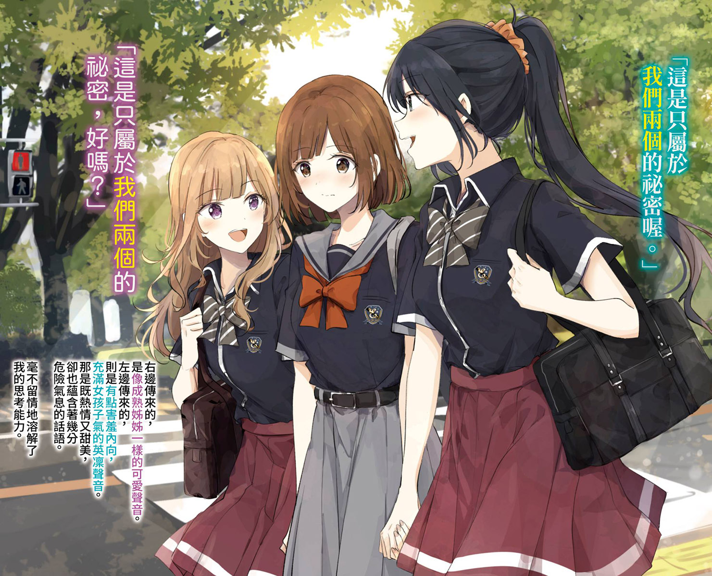
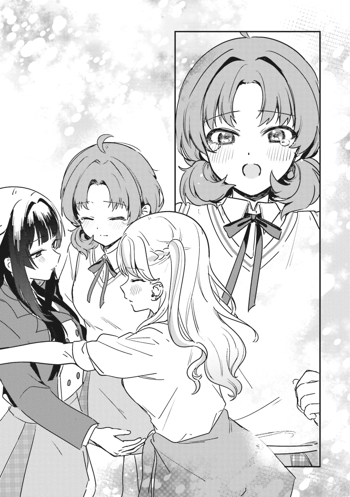
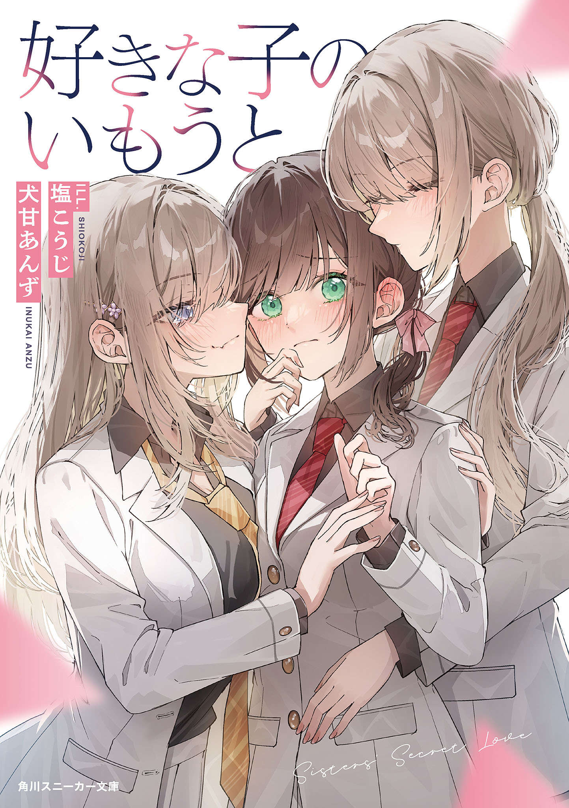
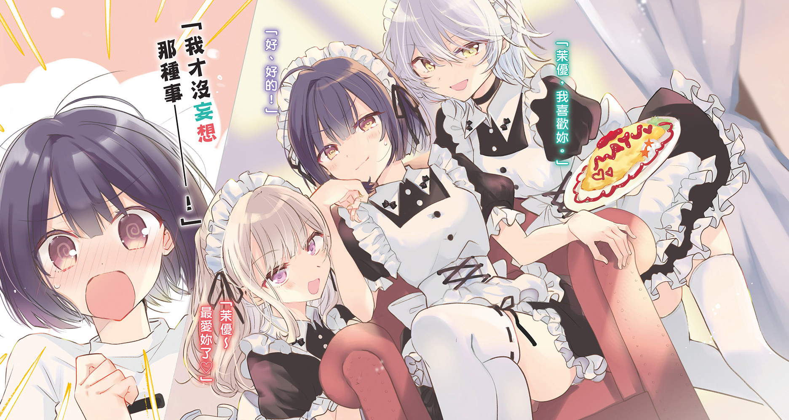
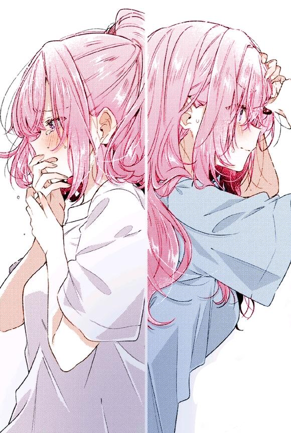
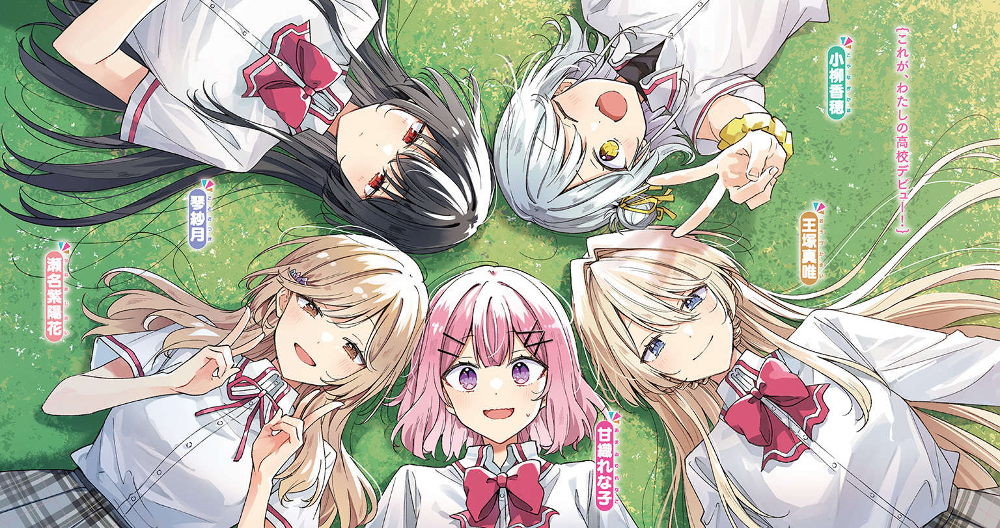

:::tip[文章说明]
本文是厦大静迹动漫社（翔安）社刊《长厦静迹·创刊号》的供稿 也[同步发布在百合会论坛](https://bbs.yamibo.com/thread-563870-1-1.html)，欢迎大家顶帖、加分❤️
:::

今年七月，《我怎么可能成为你的恋人，不行不行！(※不是不可能！？)》播出后，我一发不可收拾，接连看完了它的漫画和小说，又四处寻找类似题材的轻小说阅读。回过头来发现已经读了五个系列一共20本百合后宫题材的轻小说：

> - 《我心爱之人的妹妹》犬甘あんず & 塩こうじ
> - 《我只是想让动不动就吵架的都市辣妹与京都美人和好而已！（※不要再争夺我了！）》（山賀塩太郎 & 昆布わかめ）
> - 《被夹在百合之间的我，顺势劈腿了》としぞう & 椎名くろ
> - 《被百合夹击的女子有罪吗？ 》みかみてれん & べにしゃけ
> - 《我怎么可能成为你的恋人，不行不行！(※不是不可能！？)》みかみてれん & 竹嶋えく

除了恋人不行之外的其它四部小说的首卷封面构图几乎完全一致：女主角被夹在两位追求者中间，两侧的女孩或是笑意吟吟、或是情欲迷离，而我们的女主角则是一脸惊讶和慌张——好像在问“为什么她们会喜欢上我——”。

它们的剧情也的确是如此发展的，主角几乎无一例外地都设定为了自我评价极低的自卑女孩，由于各种机缘巧合被好几位闪闪发亮的高人气角色同时狂热地追求、争夺，进而描写混杂着党争、重女、强制爱、翅膀打结等等读者喜闻乐见的剧情展开。然而即使如此同质化的剧情框架下，这几本书也都通过主角的设定、翅膀们的个性、情节与舞台的差异做出了足够的区分度和差异化，使我阅读时收获了不同的快乐体验。

### 《被夹在百合之间的我，顺势劈腿了》（5册）

当班上有一对绝世美少女百合情侣，而你只是一个成绩外貌平平无奇的土妹子，你会选择主动与她们成为朋友吗？我们的女主间四叶误打误撞考进了名校、误打误撞地与被称为“圣域”的百合情侣成为朋友，被两位美少女同时爱慕，最后将她们双双收入后宫——当然，此前两位后宫之间的百合恋情是假扮的。

为什么两位成绩外貌性格全部点满的少女会倾心于我们平平无奇的主人公呢？答案是：“女主太亚撒西啦！！！”按照作品的说法，女主的真诚、质朴、温柔打动了她们，使她们纷纷倾心——四叶的魅力可能不在于她“有多特别”，而在于她让两个“特别”的人，第一次感受到“普通”的温暖与真实。

“万恶的亚撒西”——异世界后宫爽文的常见套路搬到百合后宫造就了奇特的混合风味，使得本作读起来轻松愉快。随着卷数增加、剧情推进，女主又接连将两个妹妹（没错，还有双重百合骨科）、天降幼驯染等一众少女通通拿下，杂以党争、骨科等等要素，真是魅魔一样的存在。

作者としぞう老师此前写过不少异世界爽文，本书作为作者初涉百合领域的成绩堪称亮眼，缺点也非常明显：角色感情线略显潦草、角色性格不够鲜明、天降剧情缺乏铺垫等等，这是他还没从普通的异世界爽文写作模式中解脱出来、没能彻底适应百合小说的写作特点的表现。但是总体来说，本作的阅读体验算得上快乐，是一部值得一看的作品。

### 《我只是想让动不动就吵架的都市辣妹与京都美人和好而已！（※不要再争夺我了！）》（1册）

“我是在乡下出生，乡下长大的，像路边小石子一样的女高中生。”

同为自认的“土妹子”，本作的女主栗本燕似乎要比间四叶还要“土”一些。她在乡下出生、长大，自认是个“野孩子”，她亲近自然、运动能力超群、质朴天真的同时又满怀着身为“乡下人”的自卑。怀揣着对都市的憧憬，她努力学习考入了东京都的升学名校，又接连结识了两位性格迥异的女孩——一个是张扬耀眼的都市辣妹、一个是高雅含蓄的京都美人。两人关系本就极差，却又都萌生了对女主的情愫，一场争夺战就这样展开……

作为今年九月底新鲜出炉的文库小说，本作的标题格式很难不让人联想到大热的《恋人不行》，但其实它们并无太多雷同之处。与《夹百》的设定相反，本作登场的两位后宫关系非常差——辣妹圣良酱性格率直张扬，而京都来的和风美人织音则是扭曲、含蓄、拐弯抹角。两人完全无法互相理解，整天吵架。先后被她们两人迷恋上之后，女主试图在其间斡旋调停，却收效甚微。终于，两人即将关系破裂转学分开的时候，女主向她们表白：“就算吵架也没关系，我们不要分开”。

“吵架是好事哦。因为只要道歉就可以和好。最糟糕的是离得太远，因为这样就再也说不出对不起。”虽然女主到最后也不肯承认自己要脚踏两条船，但是已经实质性地与两人同时恋爱。

本作的缺点与《夹百》是相似的，前期感情线稍显潦草、结构有些松散，好在本作亮眼的人设与噱头弥补了一些不足——放在中国，是不是就类似河南乡下小妞被俩京爷沪爷女同爱上的故事？

### 《我心爱之人的妹妹》（3册）

这是一个女主同时被两姐妹爱上和争夺的三角百合故事。由于原生家庭的缘故，两姐妹之间出现了巨大的嫌隙与隔阂。但偏偏她们喜欢上了同一个女生——当然也就是本书的主人公。在争夺女主的爱的过程中，经历了各种替身文学和白学剧情，两姐妹被迫从互相漠视的状态转入最低限度的交流，然后在竞争中逐渐敞开心扉互相接纳，最终走向了三人行后宫结局。相对于后宫，本作更偏向党争。

本作最吸引我的就是女主雨宫结叶的人设。不得不说，女主的人设配色实在好看——褐发、绿瞳，加上米灰色校服外套、红色领带，略带透明感的发梢……整个人设的点睛之笔就是**绿瞳**，这一抹绿鲜明地突出在红褐灰的整体配色氛围里，灵动娇俏。整体有一种洗练又朴素的美丽。 

本作的故事框架是优秀的，但是阅读体验并不算完美，甚至略微使我失望。作者的行文过于关注三个主角的互动，三本书几乎所有的自然段全在描写三个人的行动和心理，对社会（学校）背景活动的叙述以及两个重要配角（茜峯和柚叶）的活动叙述太淡太少，导致读下来感觉整个系列像是空中楼阁。除此之外，女主的性格不够鲜明，有些优柔寡断，在一众百合后宫女主里算不上讨喜。

本系列三卷完结，最后略显唐突的三人行结局也不太令人信服，铺垫三卷的两姐妹矛盾被光速处理、轻轻带过，颇给人一种“高高拿起、轻轻放下”的感觉——我阅读时甚至一度以为她们之间的矛盾是不可调和的——就这样，以一个略显潦草的结局为整个系列收了尾。综合来看这应该不是一个正常的结尾，出版社腰斩的可能性比较大。

### 《被百合夹击的女子有罪吗？ 》（1册）

身为警察局长千金的过期偶像被黑道做局了？！东京两大黑道组织一决胜负的方式居然是——让双方大姐头的女儿去用美人计争夺一名普通女子的心，先赢得其恋情者获胜！在女仆咖啡厅打工的23岁退役偶像茉优就这样在不知情的情况下被拖入了帮派争斗。可就在两位千金使出浑身解数争夺主角的过程中，却萌生了“多余的感情”：她们发现自己真的喜欢上女主了！

这场无厘头的帮派斗争最终被警方叫停，女主真实身份（警察局长千金）被揭晓的同时，又误以为曾互为对头的两位千金是互相喜欢，宣布“我谁都不选，你们俩才应该在一起！”。小说最终在欢乐又微妙的暧昧氛围中结束。

这本书的作者みかみてれん同时也是《恋人不行》的作者，本作的发售日期位于《恋人不行》2、3卷之间，行文带有很明显的みかみ个人风格，但缺乏打磨、略显稚嫩。如果这些还是可以接受的，那么这一作的阅读体验最终毁于结尾：本作的结尾可以称得上是戛然而止，主人公对两位千金的爱慕缺乏认知，对于两位后宫的感情停留在了一种类似于“CP党”的奇怪位置——“你们互相喜欢，而我欣赏你们的爱情就足够了”，形成了开放式的结局。从这里也可以很明显看出来作者是想要接着写的，最终可能出于种种原因一卷完结，令人感到非常遗憾。

### 《我怎么可能成为你的恋人，不行不行！(※不是不可能！？)》（10册）

读的越多越能感受到《恋人不行》的优秀。

百合后宫这个题材本身是天然地具有许多缺陷的，BG后宫桃文的普遍问题都会或多或少地出现在百合后宫里。例如主角脸谱化平庸化、后宫角色扁平化同质化、剧情套路严重、情感建立缺乏逻辑、为了“配平”走向流水账，等等。可在这部作品里上述的问题却总能以各种各样的方式化解掉。

这部作品没有在一开篇就急于让玲奈子展开“翅膀”，相反游刃有余地以“霸道总裁爱上我”剧情详细刻画了真唯与玲奈子的这一条恋爱线路，在此过程中通过丰富有趣的人物互动整体描摹了“五重奏”的女孩子们的人物形象，为后面她们各自的形象深化与恋爱故事铺陈动机、埋下伏笔——这是一种远视的写作策略，不追求短暂、廉价的后宫戏码，而是通过对单条线的充分刻画为单个人物形象的深化留足空间，如此便使得《恋人不行》的感情线可信度相当高，大大降低了其他百合后宫作品感情线常见的“桃文”感。

不仅如此，《恋人不行》还通过六、七两卷对玲奈子的过去、甘织姐妹的过去的接力刻画，完成了对“甘织玲奈子”这个人物形象的补完，让最核心的“主角”甘织玲奈子真正具有了人物弧光，回答了读者“凭什么这个人配得上她们的爱”的终极问题。第七卷的价值怎么评价都不为过，伏笔回收、情绪调动、以及故事本身的戏剧性都写得非常好。即使抛开我个人喜闻乐见的姐妹骨科元素不谈，这一卷的写作水准也是在整个系列中鹤立鸡群的。

《恋人不行》的成功，源于它对人物与情感刻画上的“不将就”。通过拉长战线，既保留了百合后宫题材中“被好几个美少女同时爱慕”的幻想元素，又通过细腻的心理描写和扎实的人物塑造，让这种幻想拥有了真实的情感重量。能在百合后宫这个品类里面做到丰满不刻版的人物塑造、扭曲又不沉重的阅读体验、以及对感情的深入与升华，确实仅此一家

除了得益于みかみ不断进步的写作水平，竹嶋えく老师的优秀插画也是本作的成功离不开的因素。竹岛伟大，无需多言。

---

恋人不行是我读的第一部百合后宫作品，我抱着相似的期待去寻找其他类似作品时却难以找到相似的快乐，反而在对比中更加理解了《恋人不行》的优秀。

百合后宫这个题材是在走钢丝——一边要维持“多位女性同时爱上主角”这一幻想设定，一边又要兼顾百合作品受众对细腻情感的追求。《恋人不行》没有回避这个矛盾，而是通过深入描摹玲奈子的成长弧光与诸位女主的感情历程，让这个看似不可能的设定变得合情合理。其他作品大多停留在“被爱”的愉悦上时，《恋人不行》却执着地追问“为什么被爱”。这个追问，让它在同类作品中脱颖而出，从满足幻想的轻小说，蜕变为一部关于恋爱与成长的少女青春物语。

回过头来看其他几部同样带给我快乐的作品，它们大多像一份份调味精准的快餐，能迅速带来满足感，但风味也容易随之消散；而《恋人不行》则是一席精心烹制的盛宴，主菜、配酒到甜点都环环相扣，值得在回味中反复体味。在这个常常被诟病为套路化、同质化的类型中，它证明了即使是“百合后宫”这样的题材，也完全可以写出有深度、有温度的优秀故事——这大概就是我在读完20本同类作品后，对它评价不降反升的真正原因。

