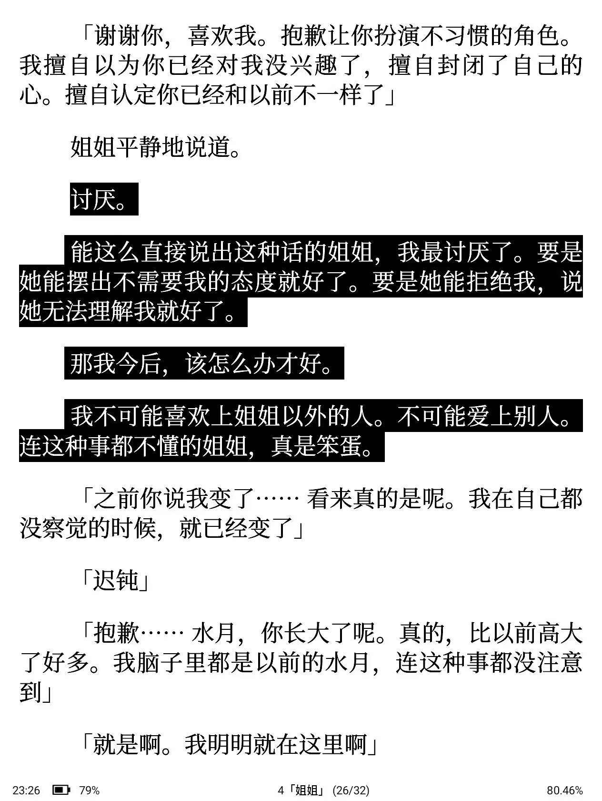
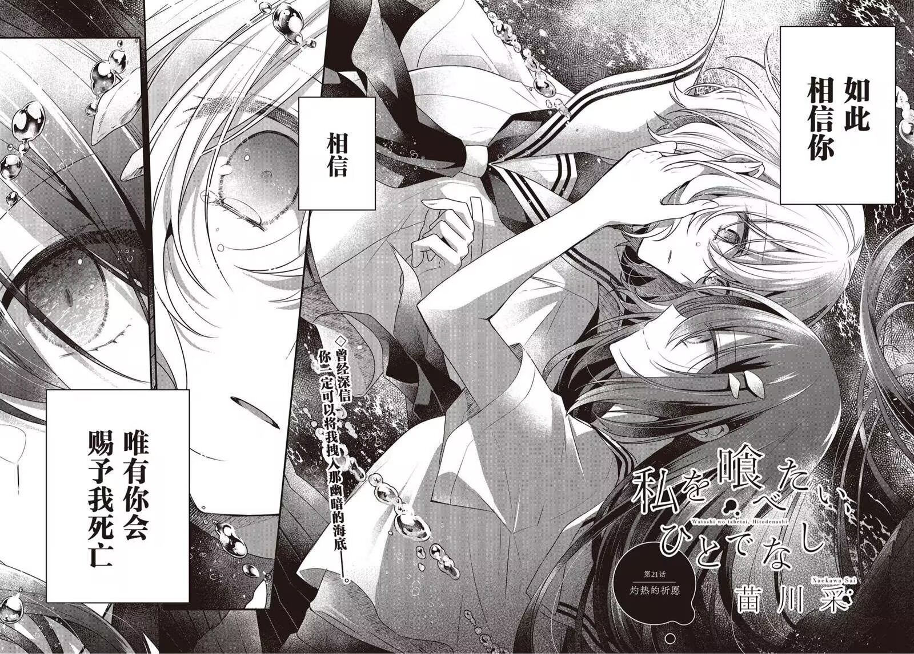

2025的年终总结很难落笔，一拖再拖，还是决定春节再发了。

2025对我而言是一个堪比高考的巨大的人生转折点，在大三~大四的这一年，我决定了自己的未来道路、完成了小有遗憾的推免保研，还暂时离开厦大，走进了未来的研究生院校进行交流学习。

在二次元上，我彻底突破了自己原来的对动画唯一的爱，投入了轻小说、漫画、galgame的怀抱。轻小说上，我读了《乐园杂音》、《义妹生活》《败犬女主》等一系列bg佳作，又广泛涉足了以《恋人不行》为代表的一系列百合轻小说，年末更是结识了《玩乐关系》这部优秀的作品。我还以此为灵感，给社刊创刊号投了轻小说鉴赏的文章。

漫画上，利用墨水屏的设备优势，狠狠阅读了一大堆百合漫画；galgame上，在群友的推荐下，玩了《金辉恋曲》《苍之彼方的四重奏》《flowers》等等优秀作品，也玩了《魔法使之夜》《魔裁》等非典型的视觉小说。我越来越深地意识到，原来二次元的世界如此广阔和美丽……

但是2025年的我也越来越神经质了，我明显感觉到，我经常性地陷入某种悲伤、困惑、痛苦的情绪无法自拔。这不是个好消息，我需要更多现实的工作和娱乐填满我空缺的精神空间，二次元的温柔乡会放大我的敏感又混乱的思绪，不能过度依赖它。

2025年是我正式入党的一年，我对国内政治、国际政治的认识飞速加深，我的政治观点、政治立场越发清晰。我们的舆论场似乎已经彻底接受了经济下行的事实，同时"对账"、"斩杀线"的大讨论又向普通网民撕开了西方世界血淋淋的一角。舆论观点越发极端、舆论对抗愈发尖锐。疾风知劲草——当此乱世，我应当用辩证和批判的目光谨慎审视每一次舆论风暴，做好自己、提升自己，时刻开展自我批评，以免过度沉溺在蜜糖或毒药之中。

2026年已经过去了两个月，可以预见的是，随着台湾问题的即将解决，东亚甚至世界的格局将迎来一次重塑，这些看似与我们的日常毫无关系的"宏大叙事"，会不会有一天劈头盖脸地砸到我的脸上？到那时，我们的日常生活还能再维持吗？还能维持多久？我没有二次元主角对抗世界的力量，我会和党站在一起，党会和我站在一起。新的一年，即将进入新环境，我会好好活下去。

:::grid{columns="3" aspect="1/1" fit="cover"}

:::
